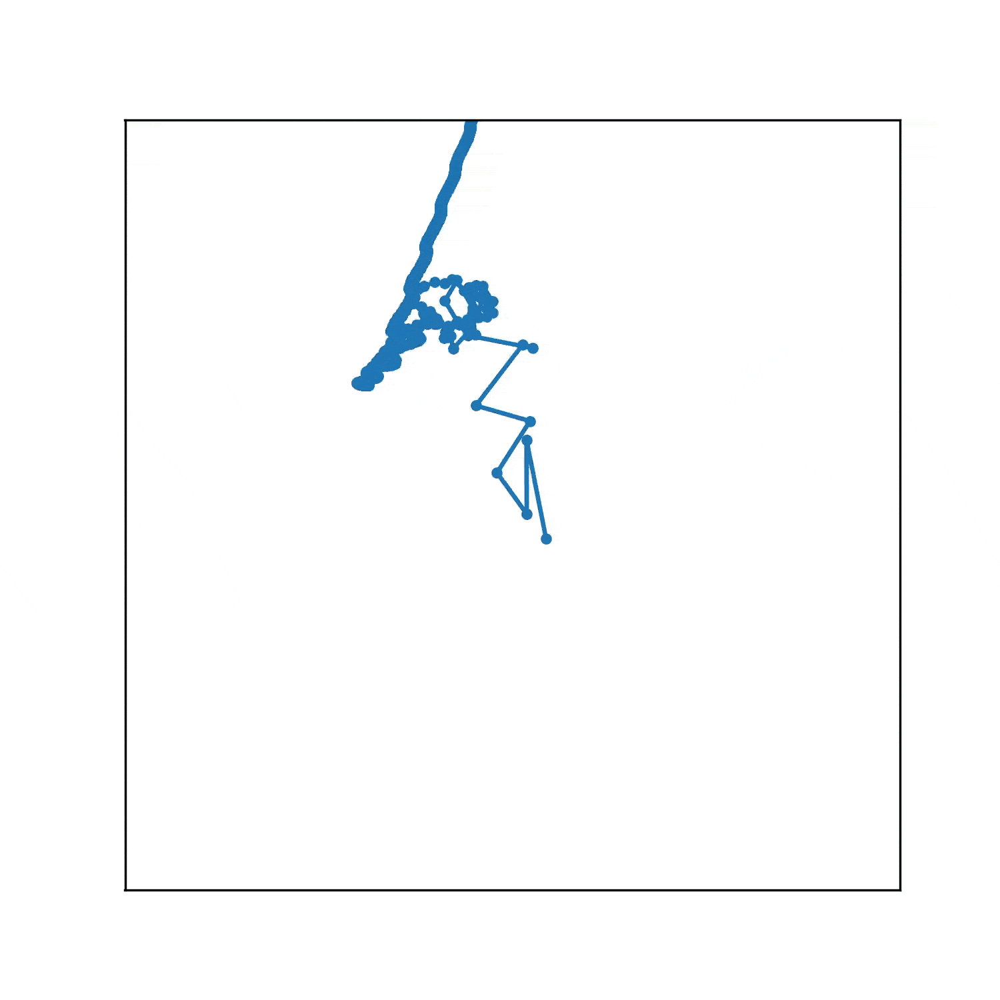

# FourierPlotter

Use complex Fourier Analysis to draw svg images

|input(svg image) |output (num_terms=5000) |
|:-:|:-:|
|||


## Installation

```shell
pip install fourierplotter
```

## Usage

```shell
fourierplotter <inputfile> --output=<outputfile>
```

## Command Line options

+ dpi
+ `--output` (string, default=`fourier_plotter.mp4`):  output filename
+ `--verbose` (flag, default=`True`): toggle progress bar
+ `--preview` (flag, default=`False`): output to live video
+ `--num_terms` (default=`500`): number of terms (in complex Fourier Analysis) to approximate target svg image
+ `--duration` (default=`10`): number of second of the output video

## Example

1. `cd` to repositiry directory

**example1**
+ `fourierplotter sample_input/office.svg --output another.mp4`

**example2**
+ `fourierplotter sample_input/office.svg --output another.mp4  --num_terms 5000 --dpi 300`